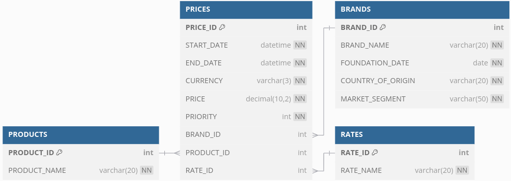

# prices-management

Microservicio para la gestión de tarifas y precios de productos de cadenas de Inditex

## Índice de contenidos

- [Instrucciones para el arranque y ejecución del servicio](#instrucciones-para-el-arranque-y-ejecución-del-servicio)
- [Instrucciones para realización de pruebas unitarias y de integración](#instrucciones-para-realización-de-pruebas-unitarias-y-de-integración)
- [Instrucciones para la explotación del servicio](#instrucciones-para-la-explotación-del-servicio)
- [Algunas indicaciones sobre el desarrollo](#algunas-indicaciones-sobre-el-desarrollo)
- [Diseño de la base de datos](#diseño-de-la-base-de-datos)

## Instrucciones para el arranque y ejecución del servicio

### Requeriminentos de sistema

- JDK 1.17 o versión posterior.
- Maven 3.6.3 o versión posterior.
  Todas las herramientas necesarias deben estar configuradas como predeterminadas en el sistema.

### Arranque del servicio

Descargar el código desde el repositorio de Github:

	https://github.com/RafaJR/PricesService.git

Una vez descargado se debe compilar el código empleando 'maven'.
Hay varios perfiles de maven habilitados con el fin de que se pueda adaptar el despliegue a un entorno de trabajo real:

- local
- dev
- pro
  Se asume que, al inicio, se desplegará el servicio en un entorno de desarrollo local, por lo que el perfil a utilizar
  sería 'local'.
  Para compilar el proyecto con el perfil 'local', ejecutar uno de estos comandos desde el directorio principal del
  proyecto en el que se ubica el archivo 'pom.xml':

- Sin tests:

        mvn clean install -DskipTests -P local

- Con tests:

        mvn clean install -P local

La distinción "Sin tests" o "Con tests" se refiere al requerimiento de ejecutar y aprobar los tesde unitarios y de
integración implementados en el servicio. Sobre estos tests se darán las explicaciones necesarias más adelante.

Una vez compilado el proyecto, se generará un archivo "prices-management-0.0.1-SNAPSHOT.jar" en la carpeta "target" del
proyecto, que estará dentro del directorio principal del mismo.
Para arrancar el proyecto debemos ejecutar este archivo, lo cual puede hacerse con este comando:

	 java -jar prices-management-0.0.1-SNAPSHOT.jar

Una vez arrancado el servicio, sus funcionalidades estarán disponibles a través de los 'endpoints' que se describen más
adelente.
Se recomienda, antes de comenzar a probar las funcionalidades del servicio, realizar una revisión del estado de salud
del mismo para comprobar que el arranque ha sido correcto. Se puede hacer con una consulta a esta URL:

    http://localhost:8080/api/health

Si todo ha ido bien, la llamada devolverá una "response" de estado "HTTP 200" con un mensaje como este:
El servicio de gestión de precios y tarifas está activo y funcionando correctamente.

También la base de datos en memoria del servicio debe haber arrancado automáticamente, las tablas del servicio deben
haberse creado y los datos iniciales de prueba deben haberse cargado. Se puede comprobar el estado de la base de datos
en esta URL:

    http://localhost:8080/h2-console/
        JDBC URL: jdbc:h2:mem:pricesmanagementdb
        User Name: admin
        * Password no necesara

## Instrucciones para realización de pruebas unitarias y de integración

Como ya se indicó en el apartado sobre el arranque del servicio, para la ejecución de todas las pruebas unitarias y de
integración bastará con compilar con maven:

    mvn clean install -P local

También es posible ejecutar los tests por separado.

## Instrucciones para la explotación del servicio

A continuación se proporciona una guía detallada para acceder a los endpoints del servicio REST prices-management
desplegado localmente en "localhost:8080", así como instrucciones para realizar pruebas funcionales utilizando Postman.

### Endpoints Disponibles

Este es el menú de funcionalidades disponbles a través de los "endpoints".

#### Health Check Endpoint

- Descripción: Este endpoint se utiliza para verificar el estado de salud del servicio.
- URL: http://localhost:8080/api/health
- Método HTTP: GET
- Funcionalidad: Retorna un mensaje indicando que el servicio está funcionando correctamente.
- Posibles Respuestas
    - 200 OK:
  ```
      {
          "status": "OK",
          "statusCode": 200,
          "message": "Service is healthy",
          "data": "UP",
          "success": true
      }
  ```

#### Price Search Endpoint

- Descripción: Este endpoint se utiliza para buscar precios basados en la fecha, producto y marca.
- URL: http://localhost:8080/api/prices/search
- Método HTTP: GET
- Funcionalidad: Busca y retorna precios de acuerdo a los criterios especificados en el cuerpo de la petición.
- Posibles Respuestas
    - 200 OK
  ````
      {
        "status": "OK",
        "statusCode": 200,
        "message": "Data retrieved successfully",
        "success": true,
        "data": [
            // Resultados de la consulta
        ]
     }
  ````
    - 404 Not Found
  ````
      {
        "status": "NOT_FOUND",
        "statusCode": 404,
        "message": "Resource not found",
        "success": false,
        "data": null
    }
  ````
    - 500 Internal Server Error
  ````
      {
        "status": "INTERNAL_SERVER_ERROR",
        "statusCode": 500,
        "message": "An error occurred while processing the request",
        "success": false,
        "data": null
    }
  ````

### Pruebas Funcionales con Postman

En la carpeta "resources/postman" del proyecto, existe un archivo llamado
"202409291053-prices-management.postman_collection.json" que contiene pruebas funcionales para el servicio REST.
Está listo para ser importado a "Postman" y probar los "endpoints" del servicio desplegado en el ámbito local "
localhost:8080"
Las pruebas incluidas en la colección Postman se corresponden con las solicitadas en el documento de requisitos del
proyecto. Estas pruebas cubren los escenarios necesarios para validar el correcto funcionamiento de los endpoints
"HealthCheck y PriceSearch".

## Algunas indicaciones sobre el desarrollo

De manera muy resumida, la definición del "stack" tecnológico aplicado al desarrollo de este servicio RESTful se puede
describir así:

- Java v17, tanto en la compilación cómo en la ejecución.
- Spring boot v3.3.4
- Implementación de Hibernate para JPA.
- Otras librerías útiles para los patrones de diseño aplicados

### Entorno de desarrollo

- Sistema operativo "Linux Mint 20.1"
- jdk-17.0.11
- IntelliJ IDEA 2024.2.3

### Estilo de código

Se han aplicado las reglas de estilo de código más estandarizadas mediante herramientas que permiten automatizar esta
tarea en el entorno de desarrollo de InteliJ IDEA.

### Patrones de diseño aplicados

En este proyecto, se va a desarrollar un servicio REST con Spring Boot para una aplicación de comercio electrónico,
específicamente para la consulta de precios aplicables a productos en función de distintos parámetros. Para alcanzar un
alto nivel de calidad en el diseño y desarrollo del servicio, se implementarán diversos patrones de diseño. A
continuación, se describen los patrones de diseño que se usarán, su aplicación específica en el proyecto y las razones
por las cuales son convenientes.

#### Initialization Pattern

Aplicación: Inicialización de la base de datos en memoria (H2) con datos de ejemplo.

Este patrón asegura que la base de datos esté inicialmente poblada con los datos necesarios para realizar las consultas,
garantizando así que los tests se ejecuten en un entorno consistente y predecible.

#### Singleton

Aplicación: Definición de los servicios críticos, como el servicio de acceso a datos.

Garantiza que ciertos componentes fundamentales del sistema tengan una única instancia, lo que facilita la gestión de
estados y recursos compartidos.

#### Microservicios REST

Aplicación: Creación del servicio REST que recibe los parámetros de la consulta y devuelve los resultados.

Descomponer la aplicación en servicios independientes y desplegables permite mayor escalabilidad, mantenibilidad y
despliegues más ágiles.

#### Arquitectura hexagonal

Aplicación: Organizar el sistema en capas que se comunican mediante interfaces, separando el dominio, la aplicación y la
infraestructura.

Promueve la separación de preocupaciones y facilita el cambio de tecnologías subyacentes sin afectar el núcleo del
negocio.

#### Service Layer

Aplicación: Implementación de una capa de servicios que atienda las peticiones REST y gestione la lógica del negocio.

Centraliza la lógica de negocio en un único punto, asegurando que las reglas y procesos del negocio se apliquen de
manera uniforme y facilitando las pruebas.

#### DTO (Data Transfer Object)

Aplicación: Traslado de datos entre las capas de la aplicación.

Mejora la eficiencia del sistema al reducir el número de llamadas remotas y la cantidad de datos transferidos, además de
desacoplar las entidades de persistencia de la capa de presentación.

#### Builder Pattern (Lombok)

Aplicación: Creación de objetos complejos como los DTO o entidades de una manera sencilla y legible.

Facilita la creación de instancias de objetos, aumentando la legibilidad y reduciendo errores en la construcción de
objetos.

#### Strategy Pattern

Aplicación: Selección de la lógica de precios aplicable en función de los parámetros de entrada.

Permite definir una familia de algoritmos y hace que estos sean intercambiables, facilitando la extensión y modificación
de la lógica de cálculo de precios sin alterar el cliente que los usa.

#### Composite

Aplicación: Gestión de múltiples condiciones y reglas que determinan el precio aplicable.

Facilita el tratamiento uniforme de estructuras y nodos compuestos, permitiendo manejar jerarquías complejas de reglas
de negocio.

#### Validation

Aplicación: Validación de parámetros de entrada en las peticiones REST y criterios de negocio.

Asegura que los datos que entran en el sistema sean correctos, protegiéndolo de posibles errores o inconsistencias.

#### DataMapper

Aplicación: Transformación de entidades de dominio a DTO y viceversa.

Facilita la conversión entre distintas representaciones de datos, manteniendo un claro desacoplamiento entre capas.

#### Entity Relationship

Aplicación: Modelado de la base de datos y las relaciones entre sus entidades.

Proporciona una estructura clara y escalable para las tablas y sus relaciones, garantizando una base de datos relacional
eficiente.

#### Audit Trail

Aplicación: Registro de cambios y acciones realizadas en el sistema.

Proporciona rastreo histórico de operaciones y modificaciones, esencial para la trazabilidad, auditoría y debugging del
sistema.

La implementación de estos patrones de diseño asegurará no solo que el servicio REST funcione correctamente, sino
también que sea altamente mantenible, escalable y robusto, cumpliendo con las expectativas de calidad y funcionalidad
del proyecto.

## Diseño de la base de datos

En este proyecto, hemos diseñado una base de datos relacional para un sistema de comercio electrónico utilizando
entidades JPA. Aunque el enunciado original no solicitaba tablas relacionadas de manera explícita, se han incluido
dichas relaciones por razones de coherencia y para asegurar una estructura de datos normalizada. Estas relaciones
permiten realizar consultas eficientes y mantener la integridad referencial de los datos.
La base de datos está compuesta por las siguientes tablas:

- PRICES: Contiene la información de los precios de los productos en distintos periodos y bajo diferentes tarifas.
- BRANDS: Representa las distintas marcas de productos.
- RATES: Almacena las diferentes tarifas aplicables a los precios.
- PRODUCTS: Incluye la información de los productos vendidos.

### Tabla PRICES

La tabla PRICES almacena la información de precios correspondientes a productos. Sus columnas incluyen identificadores
de la marca (BRAND_ID), del producto (PRODUCT_ID) y de la tarifa (RATE_ID), así como la fecha de inicio y fin de la
aplicación del precio, la prioridad, el precio final y la moneda.

### Tabla BRANDS

La tabla BRANDS almacena información sobre las marcas, incluyendo su nombre, fecha de fundación, país de origen y
segmento de mercado.

### Tabla RATES

La tabla RATES almacena las diferentes tarifas disponibles, identificando cada una con un nombre único.

### Tabla PRODUCTS

La tabla PRODUCTS almacena la información de los productos, incluyendo el nombre del producto.

### Patrones de Diseño Aplicados

En las entidades JPA, hemos aplicado varios patrones de diseño para mejorar la integridad y coherencia de los datos:
Builder Pattern (Lombok): Facilita la creación de objetos, aumentando la legibilidad y reduciendo errores.
DTO (Data Transfer Object): Permite trasladar datos entre las capas de la aplicación de manera eficiente.
Entity Relationship: Modela las relaciones entre tablas, siguiendo las mejores prácticas de diseño de bases de datos
relacionales.

### Esquema de las Tablas

A continuación, se presenta el esquema de la estructura de la base de datos, utilizando caracteres ASCII para
representar las relaciones y las claves foráneas entre las tablas.


### Explicación de Relaciones

- PRICES -> BRANDS: Cada precio está asociado a una única marca (BRAND_ID), pero una marca puede tener múltiples
  registros de precios.
- PRICES -> PRODUCTS: Cada precio está asociado a un único producto (PRODUCT_ID), pero un producto puede tener múltiples
  registros de precios.
- PRICES -> RATES: Cada precio está asociado a una única tarifa (RATE_ID), pero una tarifa puede aplicarse a múltiples
  registros de precios.

### Algunas explicaciones sobre campos específicos

Algunos campos de las tablas se han incluido siguiendo criterios no especificados en la documentación de requerimientos
y, por tanto, requieren de cierta explicación.

#### Campo "CURR" de la tabla "PRICES" - Denominación 'ISO' de la moneda en que se expresa el precio

Para dar contendio restringido de manera coherente al campo "CURR" de la tabla "PRICES", que ha de contener el
identificativo ISO de la moneda en la que se expresa el precio, se ha empleado un "enum".
Este "enum" contiene los identificadores ISO de las posibles monedas en que el precio puede expresarse. Como no tenemos
pleno conocimiento de las monedas que Inditex puede aceptar a día de hoy o en futuro, se ha optado por incluir todas las
monedas de curso legal existentes en el mundo en el tiempo presente.
Esta medida implica un consumo de memoria elevado en la ejecución, pero se ha considerado que esto simplifica el
desarrollo por ahorrar el uso de una tabla extra en base de datos y que, para una posible 'release' final, el contenido
del "enum" podría acotarse a las monedas de uso real para ahorrar recursos de máquina.

#### Campo "PRICE" de la tabla "PRICES" - Precio definitivo de un producto

El campo "PRICE" de la tabla "PRICES" debe contener el valor númerico de un precio, por lo que no ha de ser un número de
gran tamaño ni debe contener más de dos decimales. Sin embargo, se ha optado por "mapear" este campo en "JPA" como un
tipo "BigDecimal" en lugar de un tipo más pequeño como "Double". Esto implica un mayor consumo de recursos aparentemente
innecesario, pero hay buenas razones para adoptar esta medida de cara a la mantenibilidad y capacidad evolutiva del
código:

##### Precisión y Exactitud

La principal razón para utilizar "BigDecimal" en lugar de "Double" o "float" es la precisión y la exactitud que
"BigDecimal" ofrece en los cálculos con números decimales. BigDecimal permite un control muy fino sobre la precisión,
el cual es esencial en operaciones financieras donde incluso un pequeño error puede resultar en una discrepancia
significativa.

##### Problema con los Tipos de Datos de Punto Flotante

Los tipos de datos de punto flotante (float y double) utilizan una representación binaria en la memoria que no puede
representar con precisión todos los números decimales exactos.

##### Control sobre el Redondeo

Otra ventaja significativa de usar BigDecimal es el control que proporciona sobre el redondeo de los números. En
aplicaciones financieras, diferentes situaciones pueden requerir diferentes estrategias de redondeo (por ejemplo,
redondeo hacia arriba, redondeo hacia abajo, redondeo al número par más cercano, etc.).

Si bien es cierto que no se requieren operaciones de cálculo con precios para cumplir con los requerimientos
especificados en la actualidad, esta medida contribuye a la mantenibilidad y la capacidad evolutiva del código de cara
al desarrollo futuro. Es previsible que este tipo de operaciones de cálculo financiero sean necesarias en futuros
desarrollo y el tipo "BigDecimal" es idónea para los mismos.

### Especificaciones de desarrollo para la capa de datos

Se ha aplicado la implementación de 'Hibernate' para el modelo 'JPA' en el mapeo objeto-relacional de las entidades.
Se ha adjudicado a 'JPA' la tarea de generar las tabla de la base de datos, durante el proceso de arranque del servidio,
seǵun el modelo establecido en las entidades.

Para la carga de datos iniciales para las pruebas requeridas se ha aplicado el 'flyway' como 'framework'.

Se ha aplicado una configuración particular para hacer compatible la generación autómatica de tablas por parte de 'JPA'
con la carga de datos por parte de 'flyway', de modo que esta carga no se produzca hasta después de que 'JPA' genere
las tablas. Con este fin, se ha deshabilitado la participación de 'flyway' en la configuración inicial y se ha aplicado
un "Listener" para, en el momento en el que haya concluido satisfactoriamente el arranque del servicio, reescribir la
configuración del 'bean' de 'flyway' al vuelo y emplearlo para la carga de datos. Para esta carga, 'flyway' dispondrá de
una lista de ficheros ".sql" que harán efectuarán la inserción de datos.